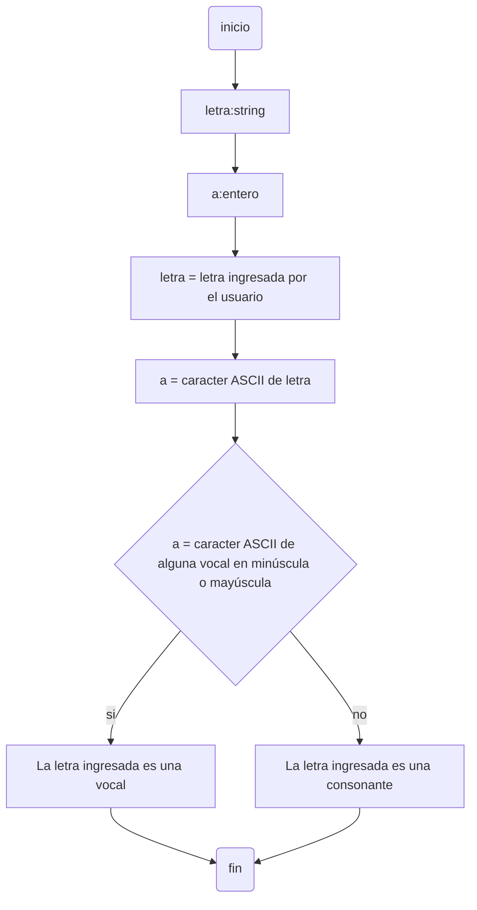

# Taller-1-Infinity-Bit-Team

```mermaid
flowchart TD
    A("inicio")-->B
    B["letra:string"] --> C["a:entero"]-->D
    D["letra = letra ingresada por el usuario"]-->E
    E["a = caracter ASCII de letra"]-->F
    F{"a = caracter ASCII de alguna vocal en minúscula o mayúscula"}
    F-->|"si"| G["La letra ingresada es una vocal"]-->I("fin")
    F-->|"no"| H["La letra ingresada es una consonante"]-->I
```
