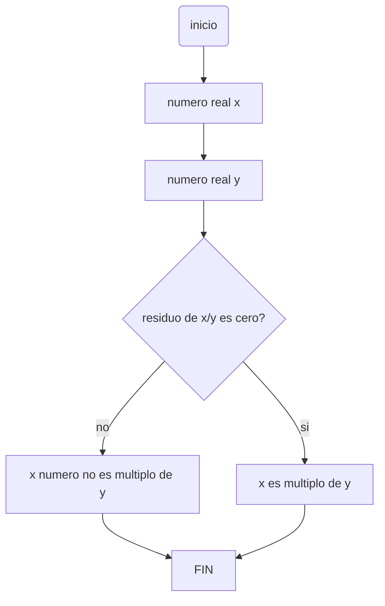

# Taller-1-Infinity-Bit-Team
>### 1.Realice el quiz Python Beginner Quiz (20 preguntas) y adjunte pantallazo con el resultado (mínimo 90% bien).
[](https://postimg.cc/ygV34CYf)
[](https://postimg.cc/9rCq2QHS)

>### 3.Realice un programa que lea un número enteros y determine si es par o impar.

Primero la variable *x* se declara como un numero entero.  Despues el ususario ingresa un numero por medio de la función *input*, y despues es convertido a un entero por medio de la funcion *int*.
```python
x : int = int(input("ingrese un número entero: "))
```
Despues si el modulo del numero que ingreso el usuario y 2 es igual; el numero es par. Ya que todo numero par es divisible por 2.
```python
x : int = int(input("ingrese un número entero: "))
if x % 2 == 0:
  print("el número" , x , "es par")
```
Sino es par, el numero es impar.
```python
x : int = input("ingrese un número entero: ")
if (int(x) % 2 == 0):
  print("el número" , x , "es par")
else:
  print("el número" , x , "es impar")
```

>### 4.Realice un programa que lea dos números reales y determine si el primero es múltiplo del segundo.
```python
x: float = input ("ingrese un número real: ")
y: float = input ("ingrese otro número real: ")
if (float(x)%float(y) == 0):
    print ("el número " , x , " es múltiplo de " , y)
else:
    print ("el número " , x , " no es múltiplo de " , y)
```
Se inicializan las variables x e y de tipo float, y por medio de la función input, se les asigna el valor que se les es ingresado por el terminal. A continuación, se pregunta si el residuo de la división del primer número entre el segundo (x/y) es 0, si esto es así, se puede afirmar que el primer número es múltiplo del segundo, así que se escribe el mensaje de que el número x es múltiplo del número y, si esta condición no se cumple, se pasa al else en donde se imprime el mensaje que dice que el número x no es múltiplo de y.

>### 5.Realice un programa que lea tres números reales y determine si la suma de los dos primeros es mayor, menor o igual que el tercer número.

Primero la variable *a*  se declara como un numero real.  Despues el ususario ingresa un numero por medio de la función *input*, y despues es convertido a un real por medio de la funcion *float*. Despues se hace lo mismo con las variables *b* y *c*
```python
a : float = float(input("Ingrese primer numero real: "))
b : float = float (input("Ingrese segundo numero real: "))
c : float = float (input("Ingrese tercer numero real: "))
```
+ Despues se escriben los casos:
 + Si la suma de los dos primeros numeros es mayor que el tercer numero
 + Si la suma de los dos primeros numeros es menor que el tercer numero
 + Si la suma de los primeros numeros es igual al tercer numero
 
```python
a : float = float(input("Ingrese primer numero real: "))
b : float = float (input("Ingrese segundo numero real: "))
c : float = float (input("Ingrese tercer numero real: "))
if a+b>c :
	print("La suma de los dos primeros numeros es mayor que el tercer numero")
elif a+b<c:
	print("la suma de los dos primeros numeros es menor que el tercer numero")
else :
	print("la suma de los primeros numeros es igual al tercer numero")
```

>### 6.Escriba un programa que solicite al usuario una letra y determine si es una vocal o una consonante.
```python
letra:str=input("escriba una letra: ")
a=ord(letra)
if (a==65 or a==69 or a==73 or a==79 or a==85 or a==97 or a==101 or a==105 or a==111 or a==117):
    print("La letra " , letra , " es una vocal ")
else:
    print("La letra " , letra , " es una consonante ")
```

Se comienza inicializando la variable letra de tipo string y asignandole un valor que es ingresado por el usuario por medio de la función input, luego, se crea la variable 'a', en la cual se va a guardar el caracter ASCII de la letra que introdujo el usuario, lo cual es posible gracias a la función ord(), quien mira que es letra y busca de acuerdo a la tabla ASCII que valor le corresponde, convirtiendo tal letra en un número entendible por la computadora. Seguido a esto, en el if, se pregunta si el número ASCII de la letra es 65 o 69 o 73 o 79 o 85 o 97 o 101 o 105 o 111 o 117, estos números corresponden respectivamente a las vocales en mayúscula (A,E,I,O,U) y a las vocales en minúscula (a,e,i,o,u), esto se hace ya que python es sensitive case y distingue entre mayúsculas y minúsculas, si alguna de esas condiciones se cumple quiere decir que la letra ingresada es una vocal, así que se imprime tal mensaje; por el contrario, si ninguna de las condiciones se cumple, se puede asegurar que la letra ingresada al no ser vocal es una consonante, así que se escribe esto.
>### 7.Escriba un programa que pida 5 números reales y calcule las siguientes operaciones:
>El promedio
>
>La mediana
>
>El promedio multiplicativo (multilplica todos y luego calcula la raíz de la cantidad de operandos)
>
>Ordenar los números de forma ascendente
>
>Ordenar los números de forma descendente
>
>La potencia del mayor número elevado al menor número
>
>La raíz cúbica del menor número
```python
a: float = float(input("Escriba el primer número real: "))
b: float = float(input("Escriba el segundo número real: "))
c: float = float(input("Escriba el tercer número real: "))
d: float = float(input("Escriba el cuarto número real: "))
e: float = float(input("Escriba el quinto número real: "))
n1: float
n2: float
n3: float
n4: float
n5: float
promedio = (a+b+c+d+e)/5
print ("Los valores ingresados son: " , a , "," , b , "," , c , "," , d , "y" , e)
print ("Su promedio es: " , promedio)
if a<=b and a<=c and a<=d and a<=e :
    n1=a
    if b<=c and b<=d and b<=e :
        n2=b
        if c<=d and c<=e :
            n3=c
            if d<=e :
                n4=d
                n5=e
            else:
                n4=e
                n5=d
        elif d<=c and d<=e :
            n3=d
            if c<=e :
                n4=c
                n5=e
            else:
                n4=e
                n5=c
        elif e<=c and e<=d :
            n3=e
            if c<=d :
                n4=c
                n5=d
            else:
                n4=d
                n5=c
    elif c<=b and c<=d and c<=e :
        n2=c
        if b<=d and b<=e :
            n3=b
            if d<=e :
                n4=d
                n5=e
            else:
                n4=e
                n5=d
        elif d<=b and d<=e :
            n3=d
            if b<=e :
                n4=b
                n5=e
            else:
                n4=e
                n5=b
        elif e<=b and e<=d :
            n3=e
            if b<=d :
                n4=b
                n5=d
            else:
                n4=d
                n5=b
    elif d<=b and d<=c and d<=e :
        n2=d
        if b<=c and b<=e :
            n3=b
            if c<=e :
                n4=c
                n5=e
            else:
                n4=e
                n5=c
        elif c<=b and c<=e :
            n3=c
            if b<=e :
                n4=b
                n5=e
            else:
                n4=e
                n5=b
        elif e<=b and e<=c :
            n3=e
            if b<=c :
                n4=b
                n5=c
            else:
                n4=c
                n5=b
    elif e<=b and e<=c and e<=d :
        n2=e
        if b<=c and b<=d :
            n3=b
            if c<=d :
                n4=c
                n5=d
            else:
                n4=d
                n5=c
        elif c<=b and c<=d :
            n3=c
            if b<=d :
                n4=b
                n5=d
            else:
                n4=d
                n5=b
        elif d<=b and d<=c :
            n3=d
            if b<=c :
                n4=b
                n5=c
            else:
                n4=c
                n5=b
elif b<=a and b<=c and b<=d and b<=e :
    n1=b
    if a<=c and a<=d and a<=e :
        n2=a
        if c<=d and c<=e :
            n3=c
            if d<=e :
                n4=d
                n5=e
            else:
                n4=e
                n5=d
        elif d<=c and d<=e :
            n3=d
            if c<=e :
                n4=c
                n5=e
            else:
                n4=e
                n5=c
        elif e<=c and e<=d :
            n3=e
            if c<=d :
                n4=c
                n5=d
            else:
                n4=d
                n5=c
    elif c<=a and c<=d and c<=e :
        n2=c
        if a<=d and a<=e :
            n3=a
            if d<=e :
                n4=d
                n5=e
            else:
                n4=e
                n5=d
        elif d<=a and d<=e :
            n3=d
            if a<=e :
                n4=a
                n5=e
            else:
                n4=e
                n5=a
        elif e<=a and e<=d :
            n3=e
            if a<=d :
                n4=a
                n5=d
            else:
                n4=d
                n5=a
    elif d<=a and d<=c and d<=e :
        n2=d
        if a<=c and a<=e :
            n3=a
            if c<=e :
                n4=c
                n5=e
            else:
                n4=e
                n5=c
        elif c<=a and c<=e :
            n3=c
            if a<=e :
                n4=a
                n5=e
            else:
                n4=e
                n5=a
        elif e<=a and e<=c :
            n3=e
            if a<=c :
                n4=a
                n5=c
            else:
                n4=c
                n5=a
    elif e<=a and e<=c and e<=d :
        n2=e
        if a<=c and a<=d :
            n3=a
            if c<=d :
                n4=c
                n5=d
            else:
                n4=d
                n5=c
        elif c<=a and c<=d :
            n3=c
            if a<=d :
                n4=a
                n5=d
            else:
                n4=d
                n5=a
        elif d<=a and d<=c :
            n3=d
            if a<=c :
                n4=a
                n5=c
            else:
                n4=c
                n5=a
elif c<=a and c<=b and c<=d and c<=e :
    n1=c
    if a<=b and a<=d and a<=e :
        n2=a
        if b<=d and b<=e :
            n3=b
            if d<=e :
                n4=d
                n5=e
            else:
                n4=e
                n5=d
        elif d<=b and d<=e :
            n3=d
            if b<=e :
                n4=b
                n5=e
            else:
                n4=e
                n5=b
        elif e<=b and e<=d :
            n3=e
            if b<=d :
                n4=b
                n5=d
            else:
                n4=d
                n5=b
    elif b<=a and b<=d and b<=e :
        n2=b
        if a<=d and a<=e :
            n3=a
            if d<=e :
                n4=d
                n5=e
            else:
                n4=e
                n5=d
        elif d<=a and d<=e :
            n3=d
            if a<=e :
                n4=a
                n5=e
            else:
                n4=e
                n5=a
        elif e<=a and e<=d :
            n3=e
            if a<=d :
                n4=a
                n5=d
            else:
                n4=d
                n5=a
    elif d<=a and d<=b and d<=e :
        n2=d
        if a<=b and a<=e :
            n3=a
            if b<=e :
                n4=b
                n5=e
            else:
                n4=e
                n5=b
        elif b<=a and b<=e :
            n3=b
            if a<=e :
                n4=a
                n5=e
            else:
                n4=e
                n5=a
        elif e<=a and e<=b :
            n3=e
            if a<=b :
                n4=a
                n5=b
            else:
                n4=b
                n5=a
    elif e<=a and e<=b and e<=d :
        n2=e
        if a<=b and a<=d :
            n3=a
            if b<=d :
                n4=b
                n5=d
            else:
                n4=d
                n5=b
        elif b<=a and b<=d :
            n3=b
            if a<=d :
                n4=a
                n5=d
            else:
                n4=d
                n5=a
        elif d<=a and d<=b :
            n3=d
            if a<=b :
                n4=a
                n5=b
            else:
                n4=b
                n5=a
elif d<=a and d<=b and d<=c and d<=e :
    n1=d
    if a<=b and a<=c and a<=e :
        n2=a
        if b<=c and b<=e :
            n3=b
            if c<=e :
                n4=c
                n5=e
            else:
                n4=e
                n5=c
        elif c<=b and c<=e :
            n3=c
            if b<=e :
                n4=b
                n5=e
            else:
                n4=e
                n5=b
        elif e<=b and e<=c :
            n3=e
            if b<=c :
                n4=b
                n5=c
            else:
                n4=c
                n5=b
    elif b<=a and b<=c and b<=e :
        n2=b
        if a<=c and a<=e :
            n3=a
            if c<=e :
                n4=c
                n5=e
            else:
                n4=e
                n5=c
        elif c<=a and c<=e :
            n3=c
            if a<=e :
                n4=a
                n5=e
            else:
                n4=e
                n5=a
        elif e<=a and e<=c :
            n3=e
            if a<=c :
                n4=a
                n5=c
            else:
                n4=c
                n5=a
    elif c<=a and c<=b and c<=e :
        n2=c
        if a<=b and a<=e :
            n3=a
            if b<=e :
                n4=b
                n5=e
            else:
                n4=e
                n5=b
        elif b<=a and b<=e :
            n3=b
            if a<=e :
                n4=a
                n5=e
            else:
                n4=e
                n5=a
        elif e<=a and e<=b :
            n3=e
            if a<=b :
                n4=a
                n5=b
            else:
                n4=b
                n5=a
    elif e<=a and e<=b and e<=c :
        n2=e
        if a<=b and a<=c :
            n3=a
            if b<=c :
                n4=b
                n5=c
            else:
                n4=c
                n5=b
        elif b<=a and b<=c :
            n3=b
            if a<=c :
                n4=a
                n5=c
            else:
                n4=c
                n5=a
        elif c<=a and c<=b :
            n3=c
            if a<=b :
                n4=a
                n5=b
            else:
                n4=b
                n5=a
elif e<=a and e<=b and e<=c and e<=d :
    n1=e
    if a<=b and a<=c and a<=d :
        n2=a
        if b<=c and b<=d :
            n3=b
            if c<=d :
                n4=c
                n5=d
            else:
                n4=d
                n5=c
        elif c<=b and c<=d :
            n3=c
            if b<=d :
                n4=b
                n5=d
            else:
                n4=d
                n5=b
        elif d<=b and d<=c :
            n3=d
            if b<=c :
                n4=b
                n5=c
            else:
                n4=c
                n5=b
    elif b<=a and b<=c and b<=d :
        n2=b
        if a<=c and a<=d :
            n3=a
            if c<=d :
                n4=c
                n5=d
            else:
                n4=d
                n5=c
        elif c<=a and c<=d :
            n3=c
            if a<=d :
                n4=a
                n5=d
            else:
                n4=d
                n5=a
        elif d<=a and d<=c :
            n3=d
            if a<=c :
                n4=a
                n5=c
            else:
                n4=c
                n5=a
    elif c<=a and c<=b and c<=d :
        n2=c
        if a<=b and a<=d :
            n3=a
            if b<=d :
                n4=b
                n5=d
            else:
                n4=d
                n5=b
        elif b<=a and b<=d :
            n3=b
            if a<=d :
                n4=a
                n5=d
            else:
                n4=d
                n5=a
        elif d<=a and d<=b :
            n3=d
            if a<=b :
                n4=a
                n5=b
            else:
                n4=b
                n5=a
    elif d<=a and d<=b and d<=c :
        n2=d
        if a<=b and a<=c :
            n3=a
            if b<=c :
                n4=b
                n5=c
            else:
                n4=c
                n5=b
        elif b<=a and b<=c :
            n3=b
            if a<=c :
                n4=a
                n5=c
            else:
                n4=c
                n5=a
        elif c<=a and c<=b :
            n3=c
            if a<=b :
                n4=a
                n5=b
            else:
                n4=b
                n5=a
print("Su mediana es: " , n3)
promedio_multiplicativo=(a*b*c*d*e)**0.2
print("Su promedio multiplicativo es: " , promedio_multiplicativo)
print("Los números ordenados de forma ascendente: " , n1 , "-" , n2 , "-" , n3 , "-" , n4 , "-" ,n5)
print("Los números ordenados de forma descendente: " , n5 , "-" , n4 , "-" , n3 , "-" , n2 , "-" ,n1)
potencia=n5**n1
print("La potencia del mayor número (",n5,") elevado al menor número (",n1,") es: " , potencia)
raiz_menor=n1**(1/3)
print("La raíz cúbica del menor número (",n1,") es: " , raiz_menor)
```
Se inicializan todas las variables como flotantes, se solicitan cinco números al usuario, este los ingresa por medio de la función input y estos se guardan en las variables a, b, c, d y e, luego se establece la ecuación de promedio y el valor de este se imprime. Después, para ordenar los números y poder sacar la mediana, se crean varios if anidados en donde básicamente se establecen todas las permutaciones posibles del orden en el que se pueden escribir los números en cuanto a cuál es la posición del mayor, menor, el del medio y los otros dos. A medida que se tiene certeza de que un número está en una posición específica, se asigna a una variable, es decir, cuando se conoce cuál es el menor número de los cinco, luego de preguntar para cada uno de ellos si es menor o igual que todos los demás, se asigna a n1, luego, para cada una de las cinco posibilidades de n1, se deben establecer más condicionales en los cuales se establezca cuál es el número que le sigue a n1, preguntando cuál de los cuatro que quedan es menor o igual que todos los otros tres valores, allí se establce n2 como el segundo valor menor. A continuación, para cada una de las combinaciones posibles que llevamos, se pregunta de los tres números que quedan cuál es menor o igual a todos los demás y este se establece en n3, siguiente a esto, para todos los posibles ordenes que llevamos de tres dígitos, se pone un condicional preguntando si uno de los números que queda es menor o igual que el otro, si es así se establece este primer número en n4 y el otro en n5 y sino, se establecen al revés. Luego, se imprime que la mediana es n3, ya que este es el valor que quedó en el medio después de ordenar los números, también se establece en una variable la ecuación de promedio multiplicativo y este se imprime. Añadiendo a esto, como ya se tiene que los números ordenados de menor a mayor son: n1, n2, n3, n4 y n5, se escribe que los números en orden ascendente son n1-n2-n3-n4-n5 y luego se escribe de igual forma que los números en orden descendente son n5-n4-n3-n2-n1. Finalmente, se establecen otras dos ecuaciones, la de potencia, en la cual se evalua el número mayor elevado al número menor (n5^n1), y, la de raíz cúbica del menor número, el cual ya conocemos, por lo que la ecuación queda n1^(1/3) y se imprimen los resultados de ambas operaciones.
>### 8.Escriba un programa al que se le ingrese la frecuencia de una onda en hz y como salida arroje en que parte del espectro electromagnético se encuentra.

Teniendo en cuenta la siguiente tabla:

[](https://postimg.cc/87cJP3Jh)

Se escriben todos los casos posibles desde rayos gamma hasta microondas, sino esta entre ninguna de estas regiones, entoncese es de radio. 
 ```python
Hz = float(input("Ingrese frecuencia de una honda en Hz: "))
if Hz>30.0e18 :
    print("La onda se encuentra en: rayos gamma")
elif Hz>30.0e15:
    print("La onda se encuentra en: rayos X")
elif Hz> 1.5e15 :
    print("La onda se encuentra en: Ultravioleta extremo")
elif Hz>7.89e14 :
    print("La onda se encuentra en: Ultravioleta cercano")
elif Hz>384e12:
    print("La onda se encuentra en: Espectro Visible")
elif Hz>120e12 :
    print("La onda se encuentra en: Infrarrojo cercano")
elif Hz>6.00e12 :
    print("La onda se encuentra en: Infrarrojo medio	")
elif Hz>300e9 :
    print("La onda se encuentra en: Infrarrojo lejano")
elif Hz>3e8 :
    print("La onda se encuentra en: Microondas") 
else :
    print("La onda se encuentra en: Radio")
```
# Extra  
## [Video](https://www.youtube.com/watch?v=BC0Rw9O60do)
